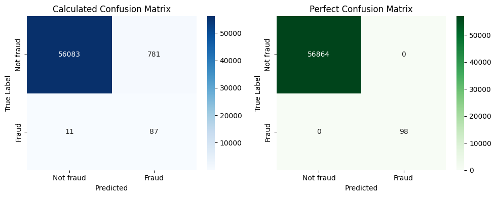

# creditcard_fraud: A data science project

### Context:
To ensure that customers are not wrongly charged for unauthorized purchases, credit card companies must be able to detect fraudulent credit card transactions effectively.

### Content:
This dataset contains transactions by European cardholders that occurred in the span of two days, where we have 492 frauds out of 284,807 transactions. The dataset is obviously unbalanced, since the positive class (frauds) account for only 0.172% of all transactions.

### Goals:
- Analyze the limited distribution of the available data.
- Generate a new balanced dataframe with an equal ratio of "Fraud" and "Not Fraud" using oversampling
- Train an AI model to accurately discriminate fraud
- Plot the result that the AI model prodused to visualize them
